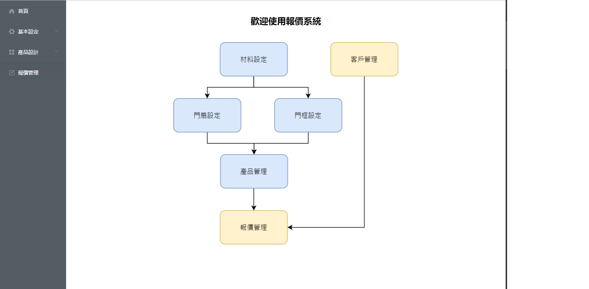

# The AL System
# 鋁門報價系統_前端




## 功能

```
- 基本設定
    -- 客戶管理
    -- 產品管理
    -- 材料種類設定
- 產品設計
    -- 材料設定
    -- 門扇設定
    -- 門框設定
- 報價管理
    -- 列印報價單PDF
```

## 安裝

```
# 前端 npm 套件下載
npm install

# 啟動專案
npm run serve
```
瀏覽器 http://localhost:8080
### 編譯 (Compiles and minifies for production)

```
npm run build
```

### 檢查錯誤  (Lints and fixes files)

```
npm run lint
```

## 專案結構
src
├─assets 圖片
├─components 元件
│  ├─Product 產品管理
│  ├─ProductDesigner 產品設計
│  │  ├─DoorLeaf 門框
│  │  └─Frame 扇
│  ├─Quotate 報價
│  └─Setting 設定
│      └─MaterialCategory 材料設定
├─plugins 插件
├─router 路由
├─store 緩存
├─utils 共用
└─views 頁面
    ├─BaseSetting 基本設定
    └─ProductDesigner 產品設計
